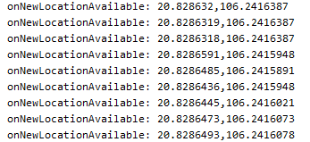
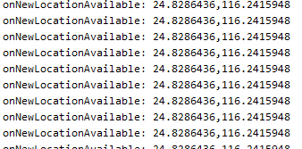

# Báo cáo tuần 6
## Những công việc đã làm
  - Xây dựng app android
  - Xác định độ tin cậy của dữ liệu GPS trên app android
  - Xác thực hình ảnh được chụp từ app
## Kết quả
### Xây dựng app android
 - Xây dựng chức năng báo cáo nhiệm vụ trên app android (chụp ảnh, báo cáo hình ảnh...)

## Xác định độ tin cậy của dữ liệu GPS trên app android
- GPS là 1 thông tin để đánh giá hình ảnh
- Sử dụng 1 số phương pháp xác định người dùng có can thiệp vào GPS, qua một số mức độ
  - Kiểm tra cài đặt cho phép vị trí ảo có được bật trên máy
  - Kiểm tra có ứng dụng được cấp quyền vị trí ảo trên máy
  - Sử dụng hàm isFromMockProvider của google (Nhiều ứng dụng tạo vị trí giả không còn bị phát hiện bởi hàm này)
  - Đánh giá chuỗi vị trí qua check vị trí liên tục VD:
    - Vị trí bình thường
    - 
    - Vị trí không tin cậy
    - 
  - Sử dụng thư viên tại
    - [https://github.com/klaasnotfound/LocationAssistant](https://github.com/klaasnotfound/LocationAssistant)
## Xác định hình ảnh được chụp từ app
- Ảnh bao gồm 1 số thông tin như Vị trí chụp, Thời gian chụp, ....
- Nhằm đảm bảo ảnh được tạo ra bởi ứng dụng mà không phải lấy từ nguồn khác, không qua chỉnh sửa
- Một số cách làm
  - Mã hóa hình ảnh
    - Đề cập tại Permutation–Substitution Based Image Encryption Algorithms Using Pseudorandom Number Generators trong Handbook Of Computer Networks And Cyber Security Principles And Paradigms Chương 33.
    - Giống với các phương pháp bảo vệ dữ liệu bằng mã hóa (AES, DES) thông thường
  - Steganography
    - Đề cập tại Recent Trends in Text Steganography with Experimental Study trong Handbook Of Computer Networks And Cyber Security Principles And Paradigms Chương 33 và Rosziati Ibrahim and Teoh Suk Kuan [Steganography Algorithm to Hide Secret Message inside
an Image](https://arxiv.org/ftp/arxiv/papers/1112/1112.2809.pdf) triển khai thử, tham khảo: [https://github.com/aagarwal1012/Image-Steganography-Library-Android](https://github.com/aagarwal1012/Image-Steganography-Library-Android)
    - Đưa dữ liệu văn bản(thông tin GPS, thời gian, ...) vào hình ảnh
    - Hình ảnh sau biến đổi không có dấu hiệu được mã hóa khi nhìn bằng mắt thường (API upload hình ảnh vẫn bình thường với các đầu vào bình thường)
    - Phân tích hình ảnh có thể xác định được ảnh có được chụp từ app hay không
    - Hình ảnh bị tăng kích thước
    - Hình ảnh không thay đổi khi nhìn bằng mắt thường như cấu trúc pixel đã có sự thay đổi
    - Không khôi phục được về hình ảnh gốc
  - Em cân nhắc sử dụng 1 trong hai phương pháp, phương pháp 1 dễ dàng hơn
### Các phương pháp trên chỉ hạn chế được gian lận chứ không ngăn được hoàn toàn do các thao tác được thực hiện hoàn toàn ở phía client
## Công việc tuần tới
- Tập trung nghiên cứu phần quan trọng - đánh giá hình ảnh
